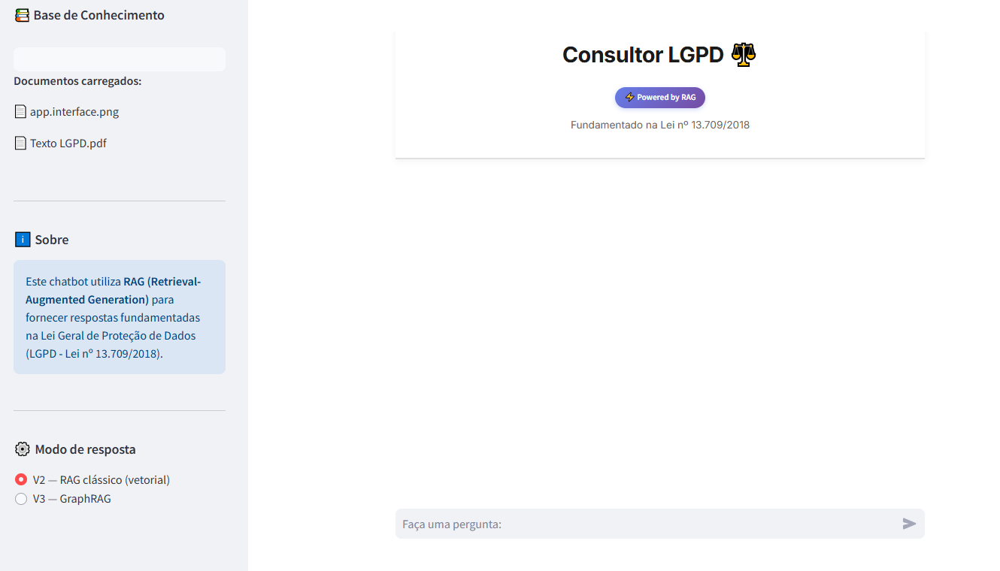

# Consultor LGPD – RAG Jurídico

Este projeto implementa um chatbot baseado em RAG (Retrieval-Augmented Generation) especializado na Lei Geral de Proteção de Dados (Lei nº 13.709/2018).

O sistema responde com base em trechos recuperados da legislação, buscando reduzir alucinações e fornecer rastreabilidade das respostas por meio da citação explícita das fontes.




## Objetivo do Projeto

Investigar e desenvolver um sistema RAG confiável aplicado a textos legais, destinado à exploração, estudo e avaliação de técnicas de recuperação e geração baseadas em LLMs, evoluindo progressivamente por meio de versões experimentais e análise empírica.

- Redução de alucinações
- Rastreabilidade via citações explícitas
- Recuperação semântica fundamentada
- Avaliação rigorosa e melhorias baseadas em dados
- Identificação sistemática de limitações

> **Nota 1:** Este projeto foi desenvolvido a partir do repositório [vitorccmanso/Rag-ChatBot](https://github.com/vitorccmanso/Rag-ChatBot), originalmente genérico para ingestão de documentos diversos.
> O sistema foi adaptado e especializado para o domínio jurídico da LGPD, com base normativa fixa, execução local e uso de modelos de embedding públicos.

> **Nota 2:** Nesta fase, optou-se por manter o texto integral dos documentos, incluindo notas editoriais e trechos revogados, a fim de estabelecer um baseline realista para avaliação do sistema. A limpeza e normalização do texto são consideradas como trabalhos futuros.

> **Nota 3:** A Versão 3 (GraphRAG) foi desenvolvida com apoio do livro *Essential GraphRAG* (Bratanič & Hane, Manning), indicado para a disciplina SIN5033 (Grafos de Conhecimento e Ontologias, PPGSI/USP). A construção do grafo segue o Capítulo 6 (extração direta de entidades via LLM), e a estratégia de retrieval é inspirada no conceito de *local search* do Capítulo 7 — sem a camada de resumos de comunidade (Louvain), considerada desnecessária para um corpus pequeno e fechado como a LGPD (~80 artigos).


## Roadmap do Projeto

### Versão 1 — Implementação (Concluída)

Sistema RAG jurídico funcional com pipeline completo.

**Principais features:**
- Chunking otimizado para textos jurídicos (86% dos artigos preservados íntegros)
- Embeddings locais (`all-MiniLM-L6-v2`)
- ChromaDB para indexação vetorial
- Retrieval semântico (top_k)
- Geração via GPT-4o-mini com prompt restritivo
- Citação automática
- Fallback controlado

**Limitações conhecidas:**
- Fallback não solicita reformulação
- Similaridade semântica pode falhar em artigos definidores
- Chunk pode não herdar metadata em alguns casos
- Sem re-ranking ou query rewriting

### Versão 2 — Avaliação e Diagnóstico (Concluída)

Avaliação empírica do sistema da V1 utilizando um gold set de 36 perguntas anotadas manualmente.

#### Metodologia

Para cada consulta foram registrados:
- Resposta gerada pelo sistema
- Artigos legais esperados
- Trechos recuperados pelo mecanismo de busca
- Avaliação manual da qualidade
- Métricas automáticas
- Classificação do comportamento (resposta direta ou fallback)

#### Resultados - Avaliação do Retrieval

Considerando apenas perguntas in-scope (com artigo esperado):

**Zero artigos recuperados:** 45,2% (Crítico)
- Quase metade das queries falha completamente

**Pelo menos 1 artigo:** 54,8% (Moderado)
- Maioria recupera algum contexto relevante

**Todos artigos esperados:** 51,6% (Moderado)
- Metade consegue cobertura completa

**Padrão identificado:** Comportamento polarizado (tudo ou nada) - quando acerta, acerta bem; quando erra, falha completamente.

**Conclusão:** Retrieval é o principal gargalo do sistema.

#### Pontos Fortes Identificados

- Sistema reconhece adequadamente perguntas fora de escopo
- Zero alucinações detectadas (todas respostas baseadas em contexto)
- LLM-as-judge teve melhor alinhamento com avaliação humana que similaridade semântica

#### Limitações Identificadas

- Alta taxa de falha na recuperação de contexto
- Fallback acionado com frequência excessiva
- Ausência de sugestões de reformulação
- Muitas respostas incorretas decorrem de contexto inadequado/insuficiente

#### Análise detalhada disponível em:

- [Notebook de análise](./analysis/evaluation/analyse_results_v2.ipynb)
- [Dados da avaliação](./analysis/evaluation/avaliacao_v2_final.xlsx)

#### Correção pós-diagnóstico: parser de metadata

Após o diagnóstico acima, foi corrigido o bug de herança de metadata identificado como limitação da V1 (*"Chunk pode não herdar metadata em alguns casos"*): o parser reconstruía o número do artigo por página, e chunks que cruzavam a fronteira de um artigo podiam herdar o número errado. Corrigido restruturando o pipeline para dividir por limite de artigo antes do chunking por tamanho, e reduzindo o `chunk_size` de 2000 para 600 caracteres (artigos com muitos incisos ficavam com embedding diluído em chunks grandes demais).

Essa correção faz parte do pipeline de retrieval vetorial (`prepare_vectordb.py`) e é independente do GraphRAG — é a base de retrieval sobre a qual a V3, abaixo, foi construída.

### Versão 3 — GraphRAG (Em avaliação)

Evolução do retrieval puramente vetorial para uma abordagem híbrida (vetorial + grafo de conhecimento), visando corrigir o gargalo identificado na V2.

#### Motivação

A V2 identificou que boa parte das falhas de retrieval ocorre em perguntas que dependem de **mais de um artigo conectado** (ex.: perguntas do gold set que exigem "arts. 1º e 3º" combinados). Similaridade semântica de texto não captura esse tipo de conexão jurídica — apenas o quão parecidas as palavras são, não a relação legal entre artigos.

#### Construção do grafo

1. Segmentação da LGPD em artigos individuais (não chunks por tamanho de caractere)
2. Extração de entidades por artigo via LLM com saída estruturada (schema Pydantic fechado): conceitos, princípios, direitos, obrigações, bases legais, agentes, sanções
3. Montagem do grafo em NetworkX: `Artigo -[DEFINE|ESTABELECE|MENCIONA]-> Entidade`, mais `Artigo -[REFERENCIA]-> Artigo` a partir de citações cruzadas explícitas extraídas via regex
4. Grafo cacheado em disco (`graph_cache/lgpd_graph.gpickle`), gerado uma única vez offline — não é reconstruído a cada execução do app

**Resultado da extração:** 325 nós (79 artigos¹ + 246 entidades), 461 arestas.

¹ *O Art. 57, integralmente vetado e sem conteúdo jurídico substantivo, foi absorvido por um artigo vizinho devido a uma peculiaridade de espaçamento na extração de texto do PDF pelo `pypdf` — sem impacto sobre o conteúdo do grafo.*

#### Retrieval híbrido

Busca vetorial (Chroma, mesma da V2) encontra artigos-semente por similaridade → expansão no grafo traz artigos conectados por referência cruzada ou entidade compartilhada → contexto final é sempre o artigo completo (não fragmento), corrigindo também o problema de diluição de chunks identificado na V2.

#### Bugs identificados e corrigidos durante o desenvolvimento

- **Poluição de retrieval por artigo vetado:** um artigo totalmente vazio (`Art. 55`, `(VETADO)`) aparecia como resultado de maior similaridade em praticamente qualquer pergunta, independente do assunto — problema de embeddings de texto muito curto. Investigação confirmou que isso **já ocorria silenciosamente na V2** (`Art. 55` presente em 30 das 36 respostas da planilha de avaliação). Corrigido com filtro de tamanho mínimo de artigo, calibrado para não excluir artigos curtos porém legítimos (ex.: Art. 21).
- **Alucinação por conhecimento prévio do LLM:** o modelo citou artigo específico (com número de inciso) que não estava presente no contexto recuperado, indicando uso de conhecimento memorizado da LGPD em vez do contexto fornecido. Corrigido via instrução explícita no prompt e redução de temperatura.
- **Segmentação de artigos:** o `pypdf` insere espaços espúrios em pontos específicos do PDF compilado da LGPD (ex.: "Art. 57" extraído como "Art. 5 7"), quebrando a divisão por artigo em dois casos — corrigido via normalização de texto antes da segmentação.

#### Avaliação parcial (em andamento)

Testadas manualmente 10 das 36 perguntas do gold set (amostra estratificada: casos que a V2 errava, controles de categorias que a V2 já acertava, e um caso fora de escopo), comparando o mesmo par pergunta/modelo entre V2 e V3 no toggle da aplicação:

| Resultado | Quantidade |
|---|---|
| Mantidas (V2 já acertava) | 6 |
| Melhoraram (V2 errava, V3 acerta) | 2 |
| Sem melhora, sem alucinação | 2 |
| Regressões | 0 |

Avaliação completa das 36 perguntas em andamento.

#### Limitações conhecidas

- Retrieval ainda depende do embedding vetorial da V2 (`all-MiniLM-L6-v2`) para encontrar as sementes iniciais; quando nenhuma semente relevante é encontrada, a expansão via grafo não tem de onde partir
- Resolução de entidade simplificada (casamento por string normalizada, não por similaridade semântica) gera nós de entidade redundantes em alguns casos
- Grafo em NetworkX local (sem Neo4j/Cypher), por decisão de manter a stack sem infraestrutura externa dado o prazo do projeto


## Arquitetura

Pipeline da V1/V2 (retrieval vetorial):

1. Ingestão offline do texto da LGPD (base normativa fixa)
2. Chunking com `RecursiveCharacterTextSplitter`
3. Geração de embeddings (`all-MiniLM-L6-v2`)
4. Armazenamento vetorial com ChromaDB
5. Retrieval semântico (top-k)
6. Geração de resposta via LLM
7. Exibição de citações (artigo + página)
8. Fallback controlado quando não há contexto suficiente

Pipeline adicional da V3 (GraphRAG, offline + runtime):

**Offline (uma vez, via `build_graph.py`):**
1. Segmentação da LGPD em artigos (`app/utils/graphrag/parser.py`)
2. Extração de entidades por artigo via LLM (`schema.py` + `extraction.py`)
3. Construção do grafo em NetworkX (`graph_builder.py`), cacheado em `graph_cache/`

**Runtime (a cada pergunta, quando o modo V3 está selecionado):**
1. Busca vetorial acha artigos-semente (`retriever.py`)
2. Expansão no grafo por referência cruzada/entidade compartilhada
3. Geração de resposta restrita ao contexto montado (`chatbot_graphrag.py`)


## Funcionalidades

- Perguntas em linguagem natural sobre LGPD
- Respostas fundamentadas exclusivamente no texto legal
- Citações explícitas das fontes (artigo e página, na V2; artigo + origem semente/grafo, na V3)
- Detecção automática de perguntas fora de escopo
- Controle de alucinação via fallback
- Toggle V2/V3 na interface para comparação direta entre RAG clássico e GraphRAG
- Interface de chat simples para consulta jurídica


## Como Executar

### Pré-requisitos

- Python 3.10 ou superior
- Chave de API da OpenAI

### Instalação

1. Clone o repositório:
```bash
git clone <url-do-repositorio>
cd <pasta-do-repositorio>
```

2. Instale as dependências:
```bash
pip install -r requirements.txt
```

3. Configure a chave da API da OpenAI:

Crie um arquivo `.env` na raiz do projeto:
```env
OPENAI_API_KEY=sua_chave_aqui
```

### Execução (V1/V2 — RAG clássico)

Execute o aplicativo Streamlit a partir da raiz do projeto:
```bash
streamlit run app/app.py
```
O aplicativo estará disponível em `http://localhost:8501`

### Execução (V3 — GraphRAG)

Antes da primeira execução, é necessário gerar o grafo de conhecimento (consome créditos de API da OpenAI, ~79 chamadas com `gpt-4o-mini`):

```bash
python app/utils/graphrag/build_graph.py
```

Isso lê `docs/Texto LGPD.pdf`, extrai entidades por artigo e salva o grafo em `graph_cache/lgpd_graph.gpickle`. Esse passo só precisa ser executado uma vez (ou sempre que o texto de origem mudar) — não é refeito a cada início do app.

Depois disso, `streamlit run app/app.py` já disponibiliza o toggle **V2 — RAG clássico / V3 — GraphRAG** na barra lateral.


## Estrutura do Projeto
```
.
├── app/                          # Aplicação Streamlit
│   ├── app.py
│   └── utils/
│       ├── chatbot.py            # Dispatcher V2/V3
│       ├── chatbot_graphrag.py   # Geração de resposta (V3)
│       ├── prepare_vectordb.py
│       ├── session_state.py
│       └── graphrag/             # Construção e retrieval do grafo (V3)
│           ├── parser.py
│           ├── schema.py
│           ├── extraction.py
│           ├── graph_builder.py
│           ├── retriever.py
│           └── build_graph.py
├── analysis/                     # V2: Avaliação
│   └── evaluation/
│       ├── analyse_results_v2.ipynb
│       └── avaliacao_v2_final.xlsx
├── graph_cache/                  # Grafo cacheado (V3, gerado por build_graph.py)
├── docs/                         # Texto normativo da LGPD
├── check_articles.py             # Diagnóstico da segmentação de artigos
├── requirements.txt
├── .env.example
└── README.md
```

## Próximos passos

Com base na avaliação parcial da V3 e no diagnóstico acumulado desde a V2:

- Completar avaliação das 36 perguntas do gold set na V3 (10/36 testadas até o momento)
- Substituição do modelo de embedding por alternativa PT-BR com viés jurídico — segue sendo o principal limitador de recall, inclusive na V3
- Resolução de entidade mais robusta no grafo (fusão semântica, não só por string normalizada)
- Migração de RetrievalQA para LCEL (V2, ainda pendente)
- Query rewriting para aproximar a pergunta do vocabulário técnico-jurídico da LGPD
- Reranking dos chunks/artigos recuperados via cross-encoder
- Fallback com sugestão de reformulação da pergunta
